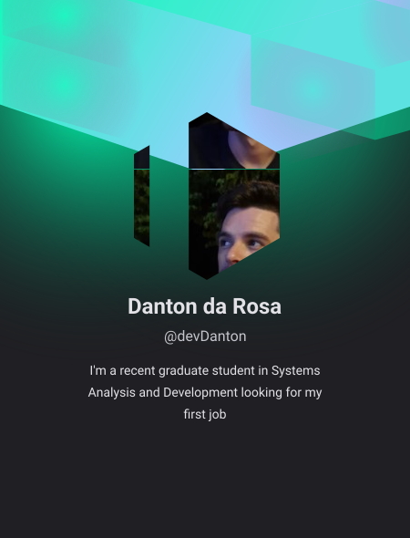

  
<h1 align="left">Hi there , i'm Danton </h1>

  

- 🎓I'm a recent graduate student in Systems Analysis and Development looking for my first job.
  
- 👨‍💻 I am currently working on some projects for my [portfolio](https://devdanton.github.io/devlinks/)

- 💬 Ask me about **HTML, CSS, JavaScript, SQL, Node.JS**

  

## 🛠 &nbsp;Tech Stack
&nbsp;
&nbsp;
&nbsp;
&nbsp;
&nbsp;
&nbsp;
&nbsp;
&nbsp;
&nbsp;
&nbsp;
&nbsp;
&nbsp;
  
## ⚙️ &nbsp;GitHub Analytics
<!-- https://github.com/anuraghazra/github-readme-stats/blob/master/themes/README.md -->

## Contact

<!--

**maykbrito/maykbrito** is a ✨ _special_ ✨ repository because its `README.md` (this file) appears on your GitHub profile.
Here are some ideas to get you started:
- 🔭 I’m currently working on ...
- 🌱 I’m currently learning ...
- 👯 I’m looking to collaborate on ...
- 🤔 I’m looking for help with ...
- 💬 Ask me about ...
- 📫 How to reach me: ...
- 😄 Pronouns: ...
- ⚡ Fun fact: ...

<!--
**devDanton/devDanton** is a ✨ _special_ ✨ repository because its `README.md` (this file) appears on your GitHub profile.

Here are some ideas to get you started:

- 🔭 I’m currently working on ...
- 🌱 I’m currently learning ...
- 👯 I’m looking to collaborate on ...
- 🤔 I’m looking for help with ...
- 💬 Ask me about ...
- 📫 How to reach me: ...
- 😄 Pronouns: ...
- ⚡ Fun fact: ...
-->
